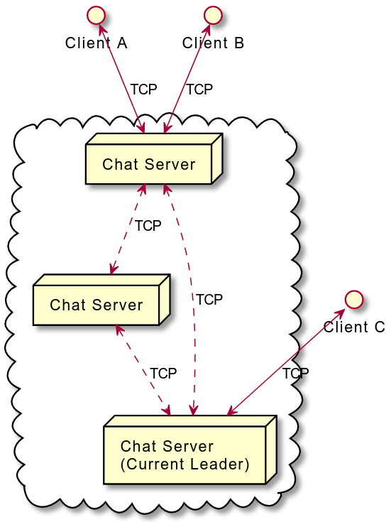
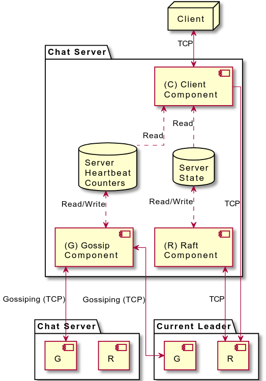

# Distributed Chat Server

> Raft-based distributed chat application.

The architecture of the system is shown in following figure. Both Client-Server and Server-Server communication will
take lace via **TCP connections** using JSON payloads. This system uses **raft** and **gossip based failure detection
system** for the operations.

The chat server can further be decomposed into 3 primary components; **(1) Client component, (2) Raft component and (3)
Gossip component**. The Client component will handle chat messages and general client interactions, while contacting the
leader when carrying out operations that change system state (e.g., creating rooms). The Raft component will keep the
server state up-to-date with the system state. (Using the Raft protocol) Finally, the gossip component will track
unreachable servers via heartbeat counters. The client component uses this collected information to hide servers that
are out of reach.

Architecture             |  Components
:-------------------------:|:-------------------------:
 |  

## Building

In Linux, simply run `run.sh ` file. It should launch the server on port 4444.
```bash
./run.sh -s MAIN -f default.tsv
```

Run following commands in order.

```bash
./gradlew shadowJar
LOG4J_LEVEL="INFO" java -jar build/libs/chat-lk.ac.mrt.cse.cs4262.server-1.0-SNAPSHOT-all.jar [PARAMS]
```

To Run the chat client,

```bash
java -jar assets/client.jar -h localhost -p 4444 -i adel
```

## Checkstyle

This project uses Checkstyle for CI. Use following command to check errors prior to sending a pull request.

```bash
./gradlew checkstyleMain
```
